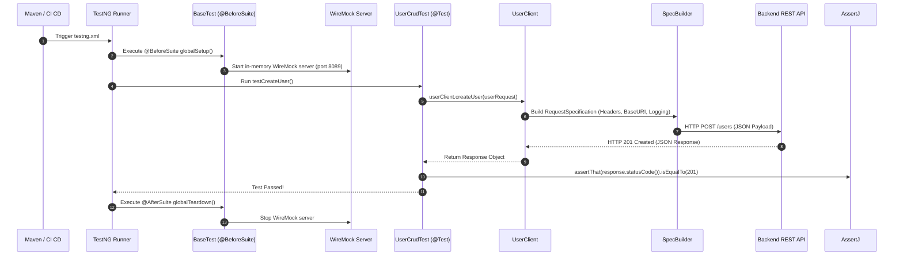

# Complete Project Explanation & Interview Guide

> **Target Audience**: Anyone looking to land a **QA Automation Engineer**, **SDET**, or **Backend QA** role.  
> **Repository**: [`enterprise-api-test-automation-framework`](https://github.com/rahulmaity0/enterprise-api-test-automation-framework)

---

## 1. The Verdict: Is this project too complex or too simple?

This project is in the **"Goldilocks" Sweet Spot (Mid-to-Senior SDET Standard)**.

### Why standard beginner projects fail:
Most tutorial projects only have one file with hardcoded code like:
```java
// What beginners do (Recruiters reject this immediately):
RestAssured.given().get("https://jsonplaceholder.typicode.com/users/1")
           .then().statusCode(200);
```
- ❌ No architecture / No layers.
- ❌ Hardcoded URLs and test data.
- ❌ No POJO models (no Jackson/JSON mapping).
- ❌ No mocking for 3rd-party services.
- ❌ No CI/CD pipeline or reporting.

### Why this project gets you hired:
This framework includes the **5 pillars that hiring managers look for in real companies**:
1. **Clean Architectural Pattern (Client-Service Pattern)**: Code is modular and reusable.
2. **Object Mapping (POJOs & Jackson)**: Proves you understand data contracts.
3. **Service Virtualization (WireMock)**: Proves you know how to test APIs when external payment gateways or third-party servers are down.
4. **Resilience & Concurrency (TestNG & RetryAnalyzer)**: Parallel multi-threading + automatic flakiness recovery.
5. **Continuous Integration (GitHub Actions + Allure)**: Tests run automatically on every code commit in the cloud.

It has enough depth to prove senior-level understanding, but is clean enough that you can explain every moving part in a 5-minute interview answer.

---

## 2. Framework Visual Map: How Everything Connects

```
                      +---------------------------------------------------------+
                      |                 GITHUB ACTIONS (CI/CD)                  |
                      |            Triggers on push/pull requests               |
                      +---------------------------------------------------------+
                                                   |
                                                   v
                      +---------------------------------------------------------+
                      |                   TESTNG TEST RUNNER                    |
                      |   - testng.xml (Parallel Execution: 4 threads)          |
                      |   - AnnotationTransformer -> RetryAnalyzer (1 Retry)    |
                      |   - TestListener (Logs start/finish, Allure attachment) |
                      +---------------------------------------------------------+
                                                   |
                                                   v
                      +---------------------------------------------------------+
                      |                       TEST LAYER                        |
                      |   - UserCrudTest (CRUD flow & assertions)               |
                      |   - UserDataDrivenTest (TestNG @DataProvider)           |
                      |   - PaymentMockTest (Tests WireMock stubs)              |
                      |   - SchemaValidationTest (JSON Schema Contract)         |
                      +---------------------------------------------------------+
                                                   |
                                                   v
                      +---------------------------------------------------------+
                      |                    API CLIENT LAYER                     |
                      |   - UserClient.java      - PaymentClient.java           |
                      |   - AuthClient.java      - OrderClient.java             |
                      |   (Wraps BaseClient GET, POST, PUT, DELETE methods)     |
                      +---------------------------------------------------------+
                                                   |
                                                   v
                      +---------------------------------------------------------+
                      |                  SPECIFICATION BUILDER                  |
                      |   - SpecBuilder.java: Adds BaseUri, ContentType(JSON),  |
                      |     Auth Bearer Token, Request/Response Logging Filters |
                      +---------------------------------------------------------+
                              /                            \
                             v                              v
+---------------------------------------+   +---------------------------------------+
|          REAL BACKEND API             |   |        WIREMOCK IN-MEMORY STUB        |
|  (https://jsonplaceholder.typicode.com)   |   |        (http://localhost:8089)        |
+---------------------------------------+   +---------------------------------------+
```

---

## 3. Detailed File-by-File Walkthrough

Here is what every single folder and file does, written in plain English:

### A. Configuration Layer (`src/main/java/com/enterprise/automation/config/`)
- **`Environment.java`**: An interface using the `Owner` library that maps configuration keys (e.g. `base.url`, `mock.server.port`, `auth.token`).
- **`ConfigManager.java`**: A Thread-Safe Singleton that loads the correct properties file depending on the environment passed in the terminal (e.g., `-Denv=qa` loads `env.qa.properties`, `-Denv=dev` loads `env.dev.properties`).

### B. Specification Layer (`src/main/java/com/enterprise/automation/specs/`)
- **`SpecBuilder.java`**: In RestAssured, rather than repeating headers, URLs, and filters in every test, `SpecBuilder` creates a reusable template (`RequestSpecification`).
  - Automatically sets `Content-Type: application/json`.
  - Injects `Authorization: Bearer <token>`.
  - Attaches `AllureRestAssured` (for reports) and `RequestLoggingFilter` / `ResponseLoggingFilter` (for console logs).

### C. Client / Service Layer (`src/main/java/com/enterprise/automation/client/`)
- **`BaseClient.java`**: Abstract class containing reusable HTTP methods: `get()`, `post()`, `put()`, `patch()`, and `delete()`.
- **`UserClient.java`**: Exposes high-level business methods: `getAllUsers()`, `getUserById(id)`, `createUser(payload)`, `deleteUser(id)`.
- **`PaymentClient.java`**: Handles payment requests sent to the WireMock service (`processPayment()`, `refundPayment()`).
- **`AuthClient.java` & `OrderClient.java`**: Handles authentication and order microservice interactions.

### D. POJO Models (`src/main/java/com/enterprise/automation/models/`)
Instead of using messy JSON strings or HashMaps, we use strongly-typed Java objects:
- **`UserRequest.java` / `UserResponse.java`**: Represents user data (name, email, address, company) with the **Builder Pattern** (`UserRequest.builder().name("John").build()`).
- **`PaymentRequest.java` / `PaymentResponse.java`**: Represents payment amounts, card numbers, currency, and transaction references.
- **`ErrorResponse.java`**: Captures standard REST error bodies (`status`, `error`, `message`, `timestamp`).

### E. Mocking / Service Virtualization (`src/main/java/com/enterprise/automation/mocks/`)
- **`WireMockService.java`**: Starts a mock HTTP server on `localhost:8089` inside the test suite:
  - When `POST /api/v1/payments/process` is called with a normal card $\rightarrow$ Returns `200 OK` with a mock transaction ID.
  - When called with a card containing `"0000"` $\rightarrow$ Returns `400 Bad Request` (`PAYMENT_DECLINED`).
  - This allows running full payment tests without calling a real bank or Stripe API.

### F. Listeners & Flakiness Recovery (`src/main/java/com/enterprise/automation/listeners/`)
- **`TestListener.java`**: Listens to TestNG lifecycle events (`onTestStart`, `onTestSuccess`, `onTestFailure`) to print colored logs and attach error stack traces to Allure.
- **`RetryAnalyzer.java`**: If a test fails due to a network blip, it automatically retries the test 1 time before declaring it a failure.
- **`AnnotationTransformer.java`**: Automatically registers `RetryAnalyzer` to every `@Test` across the whole project.

### G. Test Utilities (`src/main/java/com/enterprise/automation/utils/`)
- **`DataGenerator.java`**: Uses **Datafaker** to generate fresh, realistic names, emails, addresses, and credit cards for every test run to prevent data collisions.
- **`JsonUtils.java`**: Jackson helper for converting Java Objects $\leftrightarrow$ JSON strings.
- **`SchemaValidator.java`**: Validates whether an API response strictly matches a JSON Schema file (`user-schema.json`).

### H. The Tests (`src/test/java/com/enterprise/automation/tests/`)
- **`UserCrudTest.java`**: Tests the full lifecycle: `GET all` $\rightarrow$ `GET by ID` $\rightarrow$ `POST create` $\rightarrow$ `PUT update` $\rightarrow$ `PATCH partial` $\rightarrow$ `DELETE`.
- **`UserDataDrivenTest.java`**: Uses TestNG `@DataProvider` to execute user creation with multiple dynamic datasets in parallel.
- **`PaymentMockTest.java`**: Tests the mocked payment flows (success, declined, refund).
- **`SchemaValidationTest.java`**: Verifies that the API response strictly matches the JSON contract.

---

## 4. How a Test Executes from Start to Finish (Execution Flow)

Let's trace what happens when you run `mvn test`:



---

## 5. Interview Cheat Sheet: How to Explain This Project

### Scenario 1: Non-Technical Recruiter (30 seconds)
> *"I built an enterprise API Test Automation framework in Java using RestAssured and TestNG. It automates testing for backend microservices like User Management and Payment processing. It includes automated data generation, in-memory service mocking, and is fully integrated into a GitHub Actions CI/CD pipeline."*

### Scenario 2: Technical Interviewer / SDET Lead (2-3 minutes)
> *"For our API automation, I architected a modular framework in Java utilizing **RestAssured** and **TestNG** following the **API Client Service Pattern**:*
> 1. *We separate concerns cleanly: all endpoints and HTTP verbs are encapsulated in dedicated client classes like `UserClient` and `PaymentClient`, so test scripts never hardcode URLs or request logic.*
> 2. *We use **Jackson POJOs** with the Builder pattern for strong typing and **Datafaker** for synthetic data generation in data-driven tests.*
> 3. *For external dependencies like Payment Gateways, I integrated **WireMock** to spin up an in-memory stub server during test runs, allowing us to test success and failure flows reliably without third-party network dependencies.*
> 4. *We handle multi-environment switching (Dev, QA, Staging) using the **Owner library**, and eliminated flaky test noise using a custom TestNG `IRetryAnalyzer`.*
> 5. *Everything is automated via **GitHub Actions CI/CD**, which executes parallel test suites and generates **Allure** reports on every pull request."*

---

## 6. High-Frequency Interview Drill (Questions & Answers)

| Question | Your Confident Answer |
| :--- | :--- |
| **"Why not just write tests with Cucumber/BDD?"** | *"BDD is great when business analysts collaborate on feature files. But for pure backend microservice API testing, a code-first framework using TestNG and RestAssured is much faster, cleaner, and avoids unnecessary Gherkin glue-code overhead."* |
| **"How do you run tests in parallel?"** | *"In `testng.xml`, we configure `parallel="methods"` and `thread-count="4"`. We also set `parallel = true` on our `@DataProvider` methods so datasets execute concurrently."* |
| **"How do you test JSON contract changes?"** | *"We use `rest-assured json-schema-validator` in `SchemaValidationTest`. We store JSON Schema draft-07 definitions in `src/main/resources/schemas` and assert that the live API response matches the exact schema structure and data types."* |
| **"What happens when a test fails intermittently?"** | *"Our custom `RetryAnalyzer` intercepts failed test results and retries them once. If it passes on the second attempt, it is flagged as flaky in logs; if it fails again, it is marked as failed and the stack trace is attached to Allure."* |
